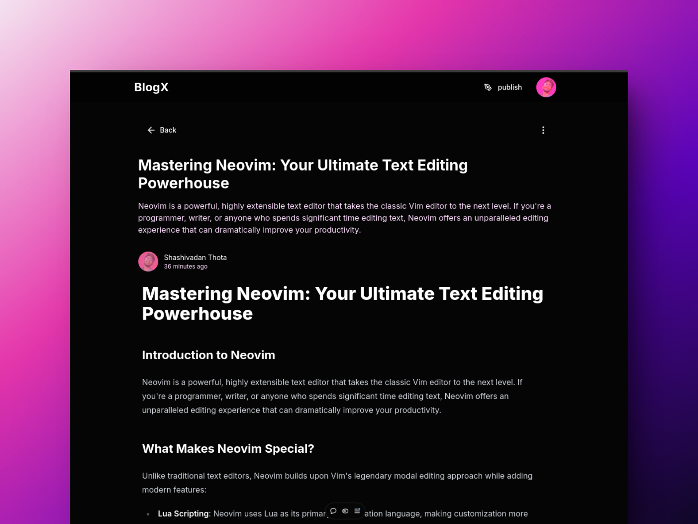
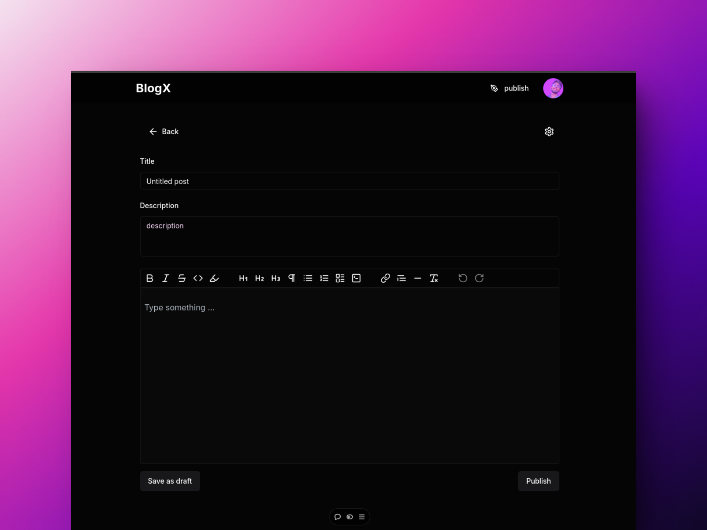
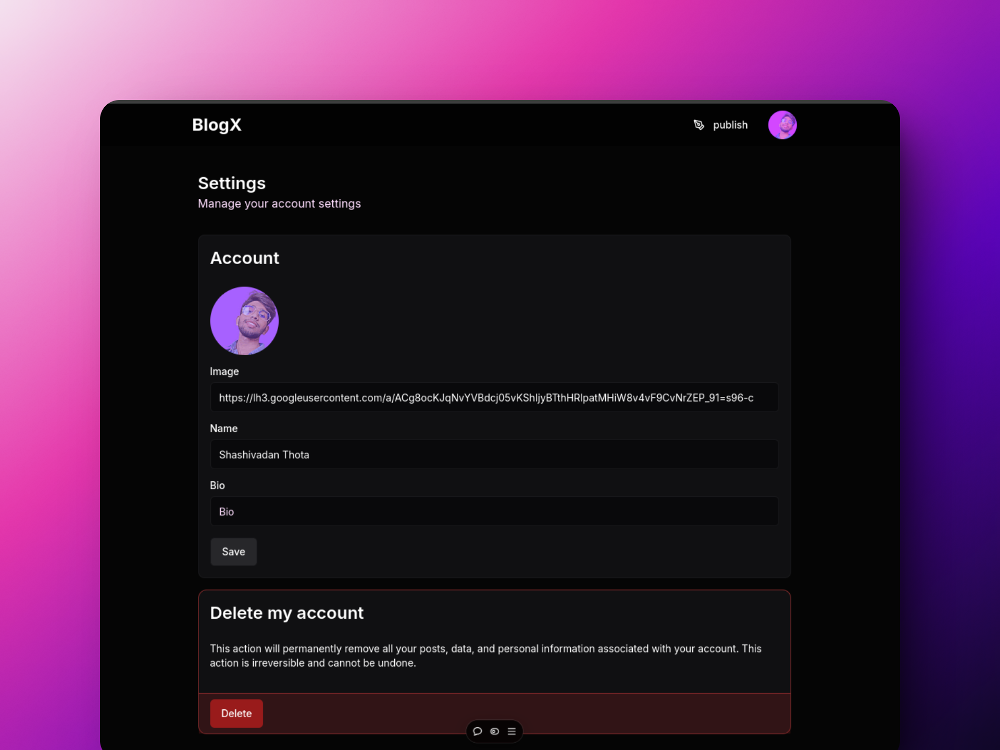
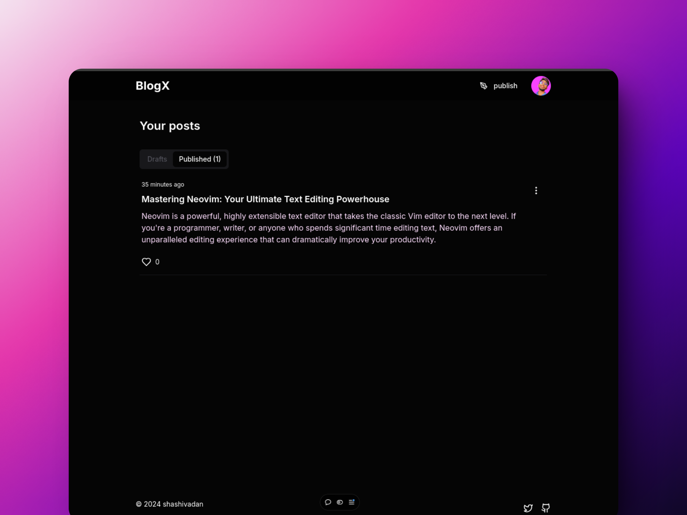
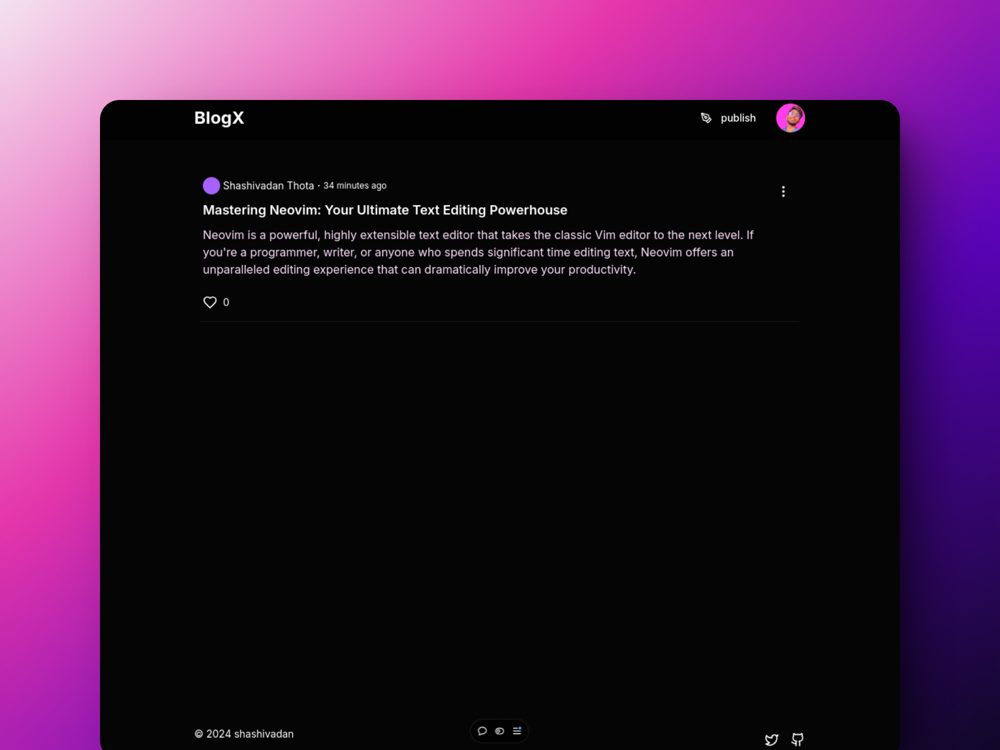

# 🌐 Blogx Website Project


## 📸 Screenshots

<div style="display: grid; grid-template-columns: repeat(3); gap: 16px; align-items: center; ">

|  |  |  |
| :-------------------------------------------------------: | :-------------------------------------------------------: | :-------------------------------------------------------: |
|  |  |

</div>

## 🚀 Overview

Blogx is a comprehensive blog website that offers a powerful platform for content creation, sharing, and user engagement. Designed with modern web technologies, it provides a seamless experience for bloggers and readers alike.

## ✨ Features

- 🔐 **User Authentication**: Secure login with JWT and Google OAuth
- ✍️ **Blog Management**: Full CRUD capabilities for blog posts
- 📝 **Rich Text Editing**: Advanced content creation tools
- 🏷️ **Content Organization**: Category and tag management
- 👤 **User Profiles**: Personalized user systems
- 📱 **Responsive Design**: Optimized for mobile and desktop
- 💬 **Interactive Comments**: Engage with your audience

## 🛠 Technologies Used

### Frontend

- **Next.js**: Modern React framework for server-side rendering and static site generation

### Authentication

- **JWT (JSON Web Tokens)**: Secure, stateless authentication
- **OAuth**: Seamless Google Sign-In integration

## 📋 Prerequisites

Before you begin, ensure you have the following:

- 🟢 Node.js (v14 or higher)
- 📦 pnpm
- 🐙 Git

## 🔧 Installation & Setup

### 1. Clone the Repository

```bash
git clone https://github.com/Shashivadan/blogx.git
cd blog-website
```

### 2. Install Dependencies

```bash
pnpm install
```

### 3. Configure Environment Variables

Create a `.env` file in the project root and add your configuration:

```bash
# Database Configuration
DATABASE_URL=your_database_connection_string

# Authentication Secrets
JWT_SECRET=your_jwt_secret
GOOGLE_CLIENT_ID=your_google_client_id
GOOGLE_CLIENT_SECRET=your_google_client_secret
```

### 4. Run the Application

```bash
pnpm dev
```

🌐 The application will be available at `http://localhost:3000`

## 🤝 Contributing

We welcome contributions! Here's how you can help:

1. 🍴 Fork the repository
2. 🌿 Create a feature branch
   ```bash
   git checkout -b feature/AmazingFeature
   ```
3. 💾 Commit your changes
   ```bash
   git commit -m 'Add some AmazingFeature'
   ```
4. 📤 Push to your branch
   ```bash
   git push origin feature/AmazingFeature
   ```
5. �integrate Open a Pull Request

## 📄 License

Distributed under the **MIT License**. See `LICENSE` for more information.

## 📞 Contact

**Shashivadan**

- 📧 Email: shashivadan99@gmail.com
- 🔗 GitHub: [@Shashivadan](https://github.com/Shashivadan)

---

**Happy Blogging!** 🎉
